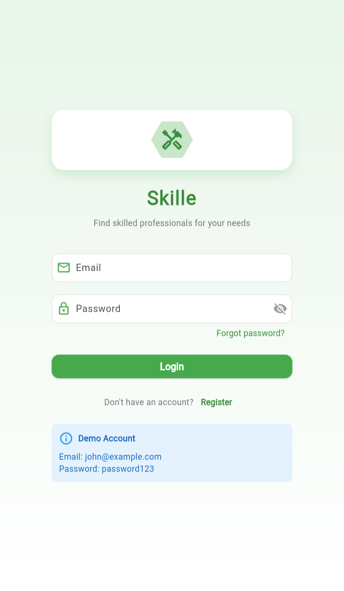
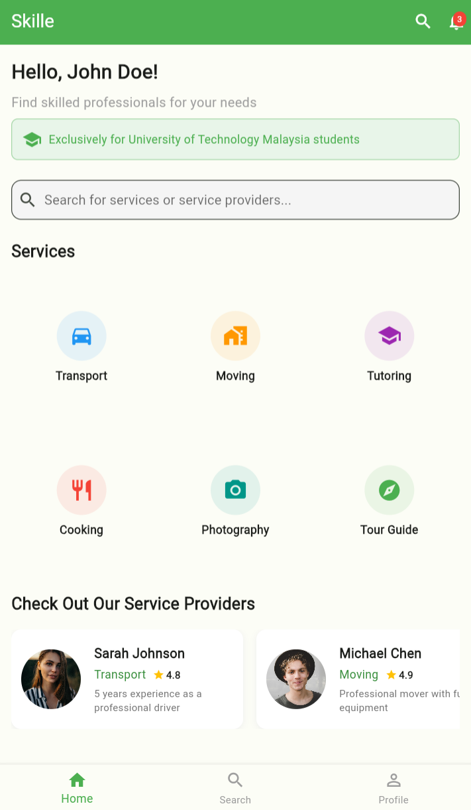
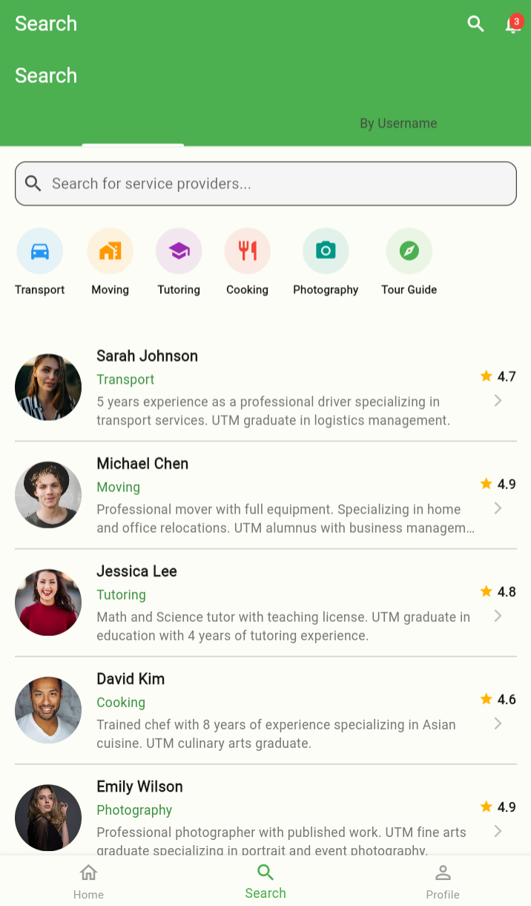
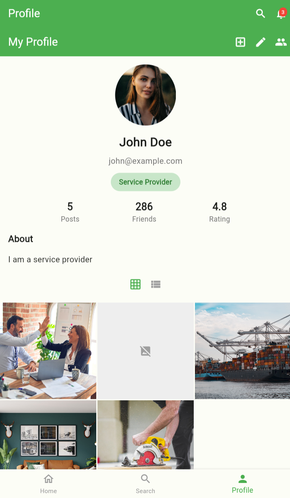
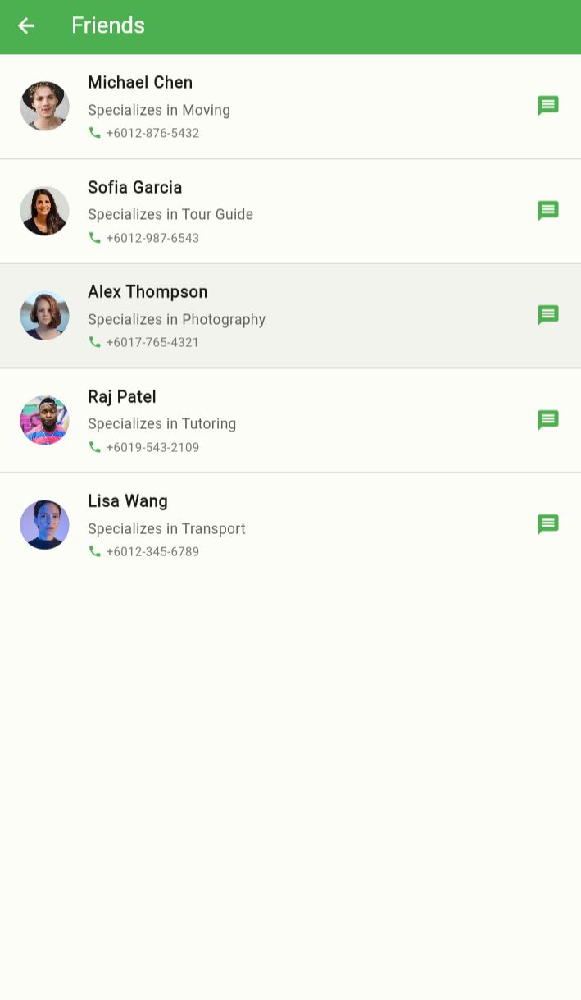
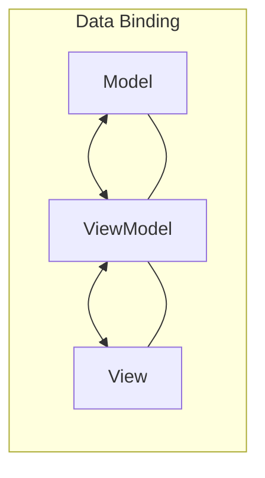
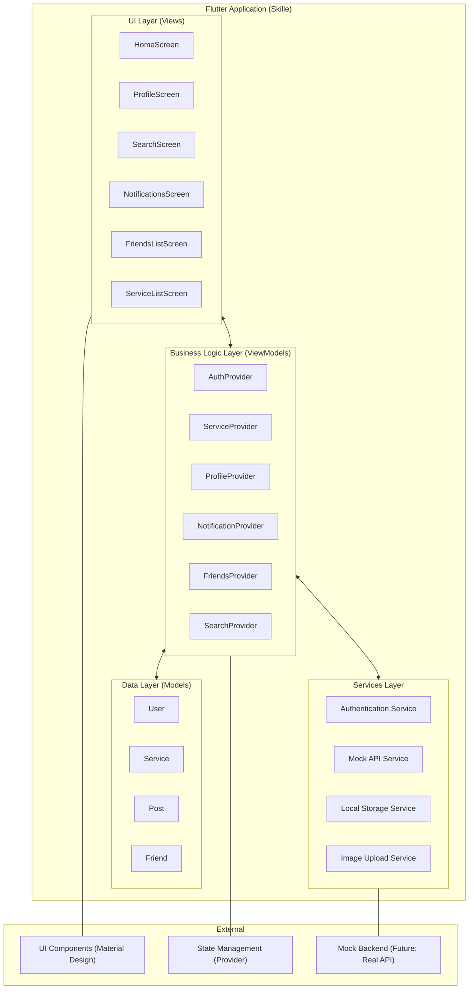
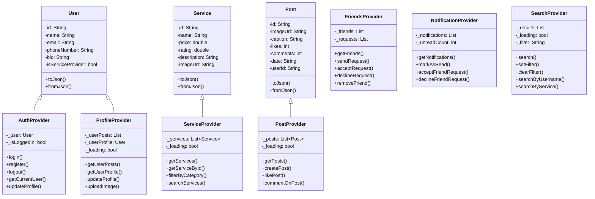

# Skille - Student Skill Exchange Platform

## About Skille

Skille is a mobile application designed to connect University of Technology Malaysia (UTM) students who offer services with those who need them. The platform facilitates a skill exchange marketplace exclusively for UTM students, allowing them to find, connect with, and hire skilled peers for various services.

This project was developed during the Mobile Application Programming (SECJ3623) course at UTM Malaysia for the 2024/2025-1 session, conducted by Dr. Jumail Bin Taliba.

## Development Team

- **Zuhayer Adnan Siddique**
- **Kevin Fachrezy**
- **Ghathfa Muhammad**
- **Adam Hadeed**

## Features

### 1. User Authentication

- Student-specific login/registration
- Profile management

<div align="center">
  <div style="display: inline-block; border: 12px solid #333333; border-radius: 36px; overflow: hidden; box-shadow: 0 10px 20px rgba(0,0,0,0.2);">
    
    <div style="background: #333333; height: 20px; margin-top: -4px;"></div>
  </div>
  <p><em>Login Screen</em></p>
</div>

### 2. Interactive Home Screen

- Service category browsing with an icon-based interface
- Featured service providers
- Quick access to all platform features

<div align="center">
  <div style="display: inline-block; border: 12px solid #333333; border-radius: 36px; overflow: hidden; box-shadow: 0 10px 20px rgba(0,0,0,0.2);">
    
    <div style="background: #333333; height: 20px; margin-top: -4px;"></div>
  </div>
  <p><em>Home Screen</em></p>
</div>

### 3. Comprehensive Search

- Search by service category
- Search by username
- Filter results based on specific criteria

<div align="center">
  <div style="display: inline-block; border: 12px solid #333333; border-radius: 36px; overflow: hidden; box-shadow: 0 10px 20px rgba(0,0,0,0.2);">
    
    <div style="background: #333333; height: 20px; margin-top: -4px;"></div>
  </div>
  <p><em>Search Screen</em></p>
</div>

### 4. Instagram-Style Profile Pages

- Grid view of posted content
- List view option
- Image upload functionality
- Bio and contact information
- Friend connection management

<div align="center">
  <div style="display: inline-block; border: 12px solid #333333; border-radius: 36px; overflow: hidden; box-shadow: 0 10px 20px rgba(0,0,0,0.2);">
    
    <div style="background: #333333; height: 20px; margin-top: -4px;"></div>
  </div>
  <p><em>Profile Screen</em></p>
</div>

### 5. Friend Management

- Send/receive friend requests
- Accept/decline requests through notifications
- View friend list

<div align="center">
  <div style="display: inline-block; border: 12px solid #333333; border-radius: 36px; overflow: hidden; box-shadow: 0 10px 20px rgba(0,0,0,0.2);">
    
    <div style="background: #333333; height: 20px; margin-top: -4px;"></div>
  </div>
  <p><em>Friends List Screen</em></p>
</div>

## System Architecture

The application is built using the MVVM (Model-View-ViewModel) architecture pattern, which provides a clean separation of concerns:



### MVVM Implementation

- **Models**: Data structures representing entities like User, Service, and Post
- **Views**: Flutter UI components (screens, widgets)
- **ViewModels**: Service providers and state management that connect the UI with data sources
- **Services**: Authentication, API communication, and local storage management

### Detailed System Architecture



### Class Diagram



## Technical Details

### Stack

- **Frontend**: Flutter/Dart
- **State Management**: Provider pattern
- **UI Components**: Material Design
- **Mock API**: Simulated backend services for demonstration

### Project Structure

```
lib/
  ├── models/          # Data models
  ├── services/        # Service classes for API and business logic
  ├── views/           # UI screens and components
  │   ├── home/        # Home screen components
  │   ├── profile/     # Profile related screens
  │   ├── search/      # Search functionality
  │   └── ...          # Other UI modules
  ├── utils/           # Utility functions and constants
  └── main.dart        # Application entry point
```

## Running the Project

### Prerequisites

- Flutter SDK (2.5.0 or higher)
- Dart SDK (2.14.0 or higher)
- Android Studio / VS Code with Flutter extensions
- Android emulator or physical device / iOS simulator

### Setup Instructions

1. Clone the repository:

   ```bash
   git clone https://github.com/yourusername/skille.git
   ```

2. Navigate to the project directory:

   ```bash
   cd skille
   ```

3. Install dependencies:

   ```bash
   flutter pub get
   ```

4. Run the application:
   ```bash
   flutter run
   ```

## Notes

This project is forked from the original repository and currently uses mock API implementations for demonstration purposes. All data shown in the application is simulated and does not represent real services or users.

## Potential Future Enhancements

- Real backend integration
- Payment processing
- In-app messaging
- Service booking system
- Reviews and ratings
- Location-based service discovery
